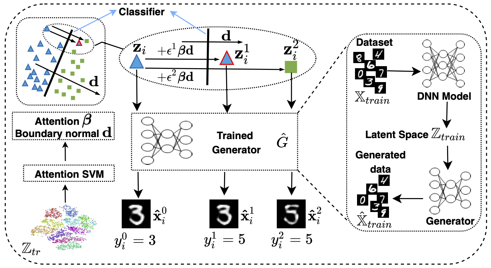

### Introduction:
---
This project is the source code for Latent Boundary-guided Adversarial Training.


### The main idea:
---
LADDER aims to generate better adversarial examples based on decision boundary constructed in a latent space. Perturbations are added to latent features along the normal of decision boundary and inverted to the input space by the trained generator. Through adversarial training with the generated adversarial examples, LADDER maintains comparable standard accuracy and achieves good adversarial robustness.  


<center>



Fig. 1: Overview of Latent Boundary-guided Adversarial Training.
</center>


### Requirements
- python 3.6.1
- pytorch 1.6.0
- torchvision 0.7.0
- scikit-learn 0.24.2
- numpy 1.18.1


### Running Code
- Dataset: MNIST 
- Pretrained weights for generator: 
- Running command:  
  For training generator:
  ```shell
	sh jobtraingenerator.sh
  ```
  For generating adversarial examples:
  ```
  sh jobgeneration.sh
  ```
  For adversarially training classifier:
  ```
  sh jobdefence.sh 
  ```

### Potential Problems:
1. When you run the generation code on CelebA dataset, it may show mismatch problem. The reason is the version of pytorch. Please use the pytorch/0.4.1
